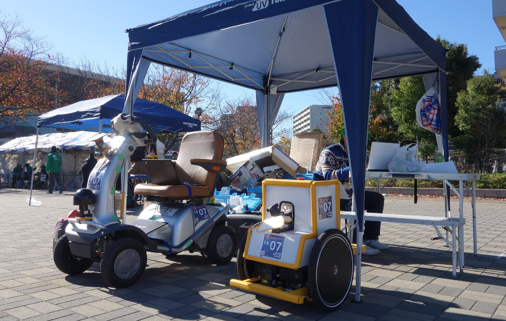

# Tsukuba Challenge 2015
つくばチャレンジ2015用のレポジトリです。  
基本的には[HSR_Hackathon レポジトリ（研究室メンバーのみ閲覧可）](http://github.com/Nishida-Lab/HSR-Hackathon)と運営の仕方は一緒です。  
詳しくはそちらをご覧ください。  



# How to Download and Use ?
1. `catkin workspace`の作成  
  好きなディレクトリに`catkin`ワークスペースを作成してください。  
  ただし、`<catkin_ws>`は自分が`catkin`ワークスペースを作成するディレクトリに読み替えてください。  
  ```bash
  mkdir -p <catkin_ws>/src
  cd <catkin_ws>/src
  catkin_init_workspace
  cd <catkin_ws>
  ```

2. `clone`  
   本レポジトリを好きなディレクトリに`clone`してください。  
   - HTTP
	 ```bash
	 git clone https://github.com/Nishida-Lab/TC2015.git
	 ```

	- SSH
	  ```bash
	  git clone git@github.com:Nishida-Lab/TC2015.git
	  ```

3. `wstool`  
   ```bash
   cd <catkin_ws>
   wstool init src src/HSR-Hackathon/.rosinstall
   ```

4. `rosdep`  
  ```bash
  cd <catkin_ws>
  rosdep install -i --from-paths src
  ```

5. `catkin_make`  
   ```bash
   cd <catkin_ws>
   catkin_make
   ```

####！！Caution！！
3.の手順で追加したパッケージは本レポジトリとは別にgit管理がされています。  
これらの追加パッケージが更新された場合は以下の手順でアップデートができます。  
```bash
wstool update -t src
```
wstoolについての詳しい説明は、以下をご覧ください。  
[ROS Wiki : wstool](http://wiki.ros.org/wstool)

# Manegement
##### 参考
- [GitHub Flow (Japanese translation)](https://gist.github.com/Gab-km/3705015)
- [Github-flowをわかりやすく図解してみた](http://b.pyar.bz/blog/2014/01/22/github-flow/)

本レポジトリでは、**GitHub flow**に従います。何だそれ？って方は、上記のリンクをご覧ください。  
clone, push, pull, mergeの流れを説明しておきます。  

1. Clone  
   本レポジトリを好きなディレクトリに`clone`してください。  
   - HTTP
	 ```bash
	 git clone https://github.com/Nishida-Lab/TC2015.git
	 ```

	- SSH
	  ```bash
	  git clone git@github.com:Nishida-Lab/TC2015.git
	  ```

2. Branchを作成  
   `master`ブランチ直下に作業内容がわかるような、任意の名前のブランチを作成してください。  
   尚、以下の`<hogehoge>`には、任意のブランチ名が入ります。  
   ```bash
   git checkout maser
   git checkout -b <hogehoge>
   ```

3. Cording  
   開発してください。  

4. Push  
   自分で作成したブランチにPushしてください。  
   ```bash
   git push origin <hogehoge>
   ```

5. Pull Request  
   Github上で、Pull Requestを作成してください。  
   **Pull Request**ってなんぞ？っていう方は、[こちらの記事](http://qiita.com/samurairunner/items/7442521bce2d6ac9330b)が参考になると思います。  
   Pull Requestの結果、
   - 許可されたら（リーダが、masterブランチへmergeします。）  
	 もし、開発が終了していなければ、再び手順3. へ。  
	 開発が終了していれば、ブランチを削除してください。
	 ```bash
	 git checkout master
	 git branch -d <hogehoge>
	 ```

	- 許可されなかったら（GitHub上のPullRequestに、いちゃもんメッセージが付けられます。）  
	手順3. へ。頑張ってください。

6. Pull  
   手順5. が終わっている方のみ、Pullしてください。  
   ```bash
   git pull origin master
   ```

以上が、GitHub-flowの手順です。参考リンクにわかりやすいフローチャートがあります。ぜひ見てください。  
HSR Hackathonでは，Git-flowを使おうとしましたが、必要のないブランチが増え、非常に複雑になってしまったので、この方式に変えました。  
HSR Hackathon参加者の方は、これまでの`develop`ブランチが`master`ブランチに変わり、`feature/hoghoge`ブランチが`hogehoge`ブランチになっただけと考えてください。  

## Synnary
ご意見がございましたら、是非是非、[RyodoTanaka](http://github.com/Ryodotanaka)までお知らせください。  
参加者を募集しています。よろしくお願いします。 m(_ _)m
